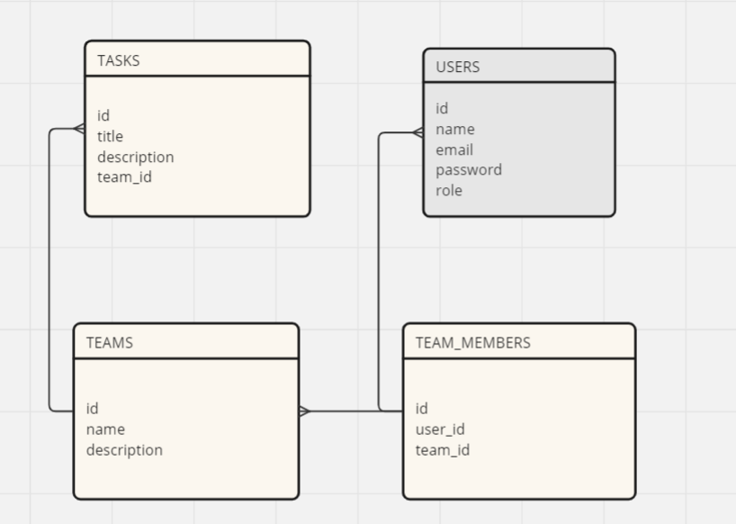

# Funcionalidades del Proyecto

## Autenticación y Autorización

* Registro de usuarios.

* Inicio de sesión y cierre de sesión.

* Recuperación de contraseñas.

* Roles de usuario (Administrador, Miembro).

## Gestión de Equipos

* Crear un equipo.

* Agregar y eliminar miembros del equipo.

* Listar todos los equipos a los que pertenece un usuario.

## Gestión de Tareas

* Crear una tarea dentro de un equipo.

* Actualizar y eliminar tareas.

* Listar todas las tareas de un equipo.

## UML

